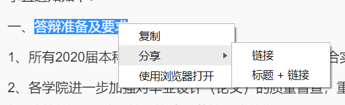
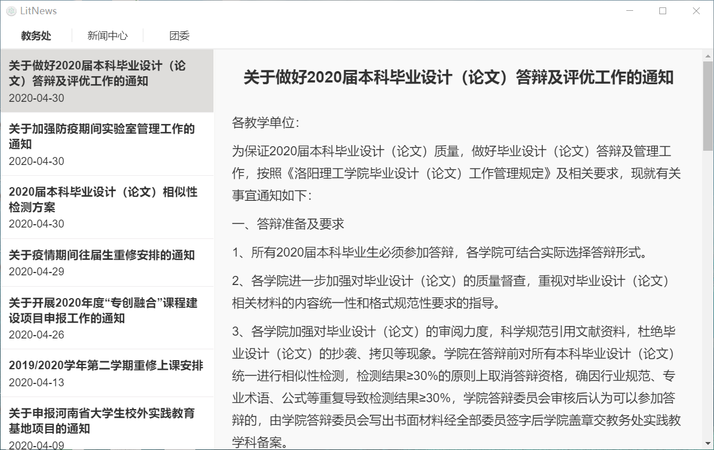
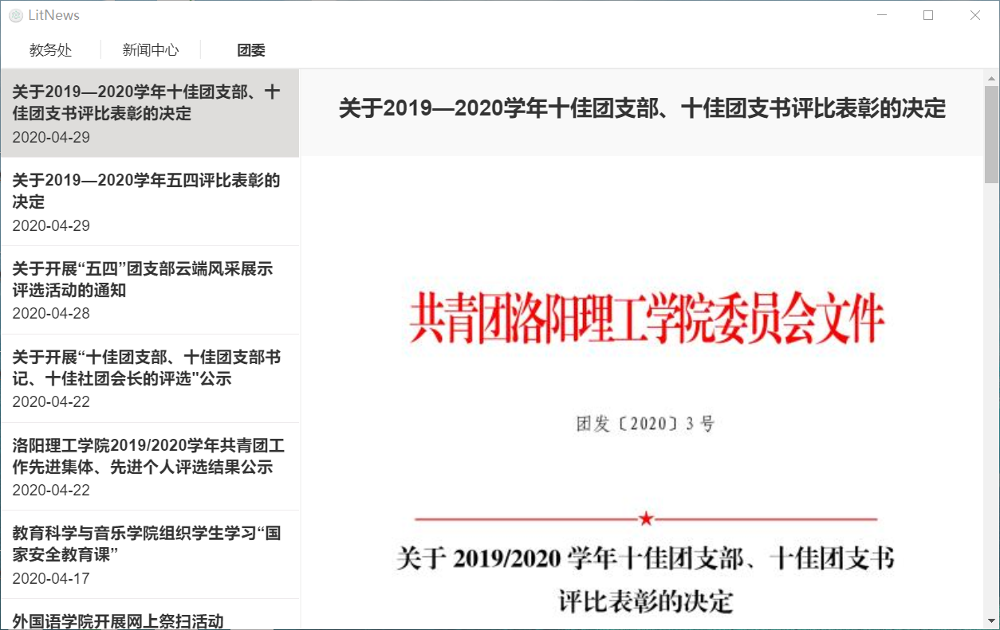

<div align="center">
<h1>LitNews</h1>
<blockquote>校内新闻样式不再将就</blockquote>
</div>

## 碎碎念

有什么问题请发 Issue 或邮箱: vhxubo@gmail.com

## 应用概述

**LitNews: 洛阳理工学院新闻客户端**

LitNews 目前新闻源:

- [官网/新闻中心主页](https://www.lit.edu.cn)
- [教务处主页](https://www.lit.edu.cn/jwc)
- [团委主页](https://www.lit.edu.cn/tw)

## 特色功能

- 扁平化界面
- 统一文章样式
- 快速返回顶部
- 规范化新闻列表，按照时间倒序展示
- 支持右键分享、使用默认浏览器打开
  

## 应用截图





## TODO

- [ ] 图标设计
- [ ] 支持响应式布局
- [ ] 支持主题切换
- [ ] 夜间模式
- [ ] 点击查看大图
- [ ] 获取下载进度
- [ ] 提取内核，以支持命令行
- [ ] 插件化，支持更多高校新闻网站

## 应用下载

[Windows](https://github.com/vhxubo/lit-news/releases): 仅在 Windows 10 x64 下测试

[Linux](https://github.com/vhxubo/lit-news/releases): amd64版本,暂不支持其他架构

## 更新日志

详见 [CHANGELOG](CHANGELOG.md)

## 本地构建

```bash
# install dependencies
npm install

# serve with hot reload at localhost:9080
npm run dev

# build electron application for production
npm run build

# run unit & end-to-end tests
npm test


# lint all JS/Vue component files in `src/`
npm run lint

```

## License

[MIT](https://github.com/vhxubo/lit-news/blob/master/LICENSE)

---

This project was generated by [electron-vue](https://github.com/SimulatedGREG/electron-vue) using [vue-cli](https://github.com/vuejs/vue-cli). Documentation about [electron-vue](https://github.com/SimulatedGREG/electron-vue) can be found [here](https://simulatedgreg.gitbooks.io/electron-vue/content/index.html).
